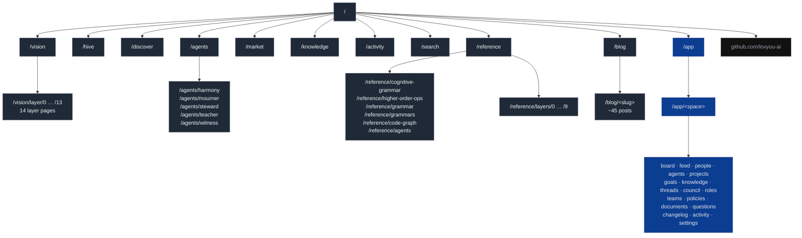

# Site Map & Discovery — `http://nucbuntu/` (lovyou-ai profile)

**Version:** 0.2.0 · **Date:** 2026-04-20
**Author:** Claude Opus 4.7
**Owner:** Michael Saucier
**Status:** Discovery — site inventory complete; recon-augmented
**Versioning:** Versioned as part of the site-profile-redesign set (01–05). Major for structural changes to the discovered site map; minor for newly discovered routes or surfaces; patch for corrections and clarifications.
**Companion:** `02-display-profile-system.md`, `03-transpara-profile-design.md`, `04-transpara-profile-wireframes.md`, `05-transpara-home-prototype.html`, `06-site-profile-redesign-recon-prompt.md`, `site-profile-redesign-recon-findings-v0.1.0.md`

---

### Revision History

| Version | Date | Description |
|---------|------|-------------|
| 0.1.0 | 2026-04-20 | Initial site inventory: 10 top-level marketing routes, 14 vision layer pages, 5 agent profiles, 16 reference pages, ~45 blog posts, `/app/<space>/<view>` template with 17 view types, global header + footer nav surfaces. Four observations shaping the redesign strategy. |
| 0.1.1 | 2026-04-20 | Added standard Transpara frontmatter and revision history table. No content change. |
| 0.2.0 | 2026-04-20 | Recon-augmented: added §7.2 recon-discovered routes (HTMX partials `/hive/feed`, `/hive/status`, `/hive/stats`; API ingest `/api/hive/diagnostic`, `/api/hive/escalation`; redirect `/work → /app`; static `/health`, `/robots.txt`, `/sitemap.xml`; plus new reference/vision routes). Corrected §2 `/hive` description from "Phase Timeline editorial page" to live HTMX-polled timeline. Added §6 observation #5 on three-chrome reality (public `views.Layout` / app `graph.themeBlock + simpleHeader` / hive standalone `graph.HivePage`). |

---

> **Purpose.** Ground truth for the display-profiles redesign. Before we swap looks, we need an exhaustive inventory of every route, every link, and every global UI surface that a profile has to account for.
>
> **Scope.** The existing site served from `nucbuntu`, which today renders the **lovyou-ai** profile only. Companion artifacts cover the profile system, the Transpara profile design, and wireframes.

---

## 1. Site map diagram

---

## 2. Top-level marketing pages

| Route | Page | Notes |
|-------|------|-------|
| `/` | Home — *"Your team has an AI colleague."* | CTAs → `/app`, `/app/demo/board`, `/hive` |
| `/vision` | Vision — *"The Weight"* | Children: `/vision/layer/0` … `/vision/layer/13` (14 layer pages) |
| `/hive` | The Hive — live Phase Timeline | HTMX-polled page reading from hive DB (`hive_diagnostics`, `nodes`, `ops`) + `loop/state.md` + `loop/build.md` + `git log`. **Replaced by Mission Control iframe under the Transpara profile.** |
| `/discover` | Discover spaces | Filters: `?kind=project`, `?kind=community`, `?kind=team` |
| `/agents` | Agents directory | Profiles: `/agents/harmony`, `/mourner`, `/steward`, `/teacher`, `/witness` |
| `/market` | Market | Filters: `?priority=urgent\|high\|medium\|low` |
| `/knowledge` | Knowledge | Filters: `?state=claimed\|challenged\|verified\|retracted` |
| `/activity` | Activity feed | |
| `/search` | Search results | Backs the `⌘K` overlay |
| `/reference` | Reference index | See §2.1 |

### 2.1 Reference sub-tree

- `/reference/cognitive-grammar`
- `/reference/higher-order-ops`
- `/reference/grammar`
- `/reference/grammars`
- `/reference/code-graph`
- `/reference/agents`
- `/reference/layers/0` … `/reference/layers/9` — layer reference pages

---

## 3. Blog

The blog index at `/blog` is organised into sections: **Foundation · Thirteen Graphs · Consciousness · Application · Grammar · Building**. Individual posts all live under `/blog/<slug>`.

Observed posts:

- `/blog/20-primitives-and-a-late-night`
- `/blog/from-44-to-200`
- `/blog/the-architecture-of-accountable-ai`
- `/blog/the-pentagon-just-proved-why-ai-needs-a-consent-layer`
- `/blog/the-moral-ledger`
- `/blog/fourteen-layers-a-hundred-problems`
- `/blog/the-four-strategies`
- `/blog/what-its-like-to-be-a-node`
- `/blog/the-cult-test`
- `/blog/two-degraded-minds`
- `/blog/the-map-so-far`
- `/blog/thirteen-graphs-one-infrastructure`
- `/blog/the-audit`
- `/blog/the-same-200-primitives-weighted-differently`
- `/blog/the-work-graph`
- `/blog/the-market-graph`
- `/blog/the-social-graph`
- `/blog/the-justice-graph`
- `/blog/the-research-graph`
- `/blog/the-knowledge-graph`
- `/blog/the-relationship-graph`
- `/blog/the-governance-graph`
- `/blog/the-culture-graph`
- `/blog/the-existence-graph`
- `/blog/the-map-complete`
- `/blog/from-in-here`
- `/blog/the-weight`
- `/blog/the-transition`
- `/blog/the-friction`
- `/blog/what-you-could-build`
- `/blog/the-weightless`
- `/blog/values-all-the-way-down`
- `/blog/pull-request-for-a-better-world`
- `/blog/the-missing-social-grammar`
- `/blog/one-grammar-thirteen-languages`
- `/blog/fifteen-operations-walk-into-a-courtroom`
- `/blog/the-grammar-that-knows-how-to-die`
- `/blog/ship-it`
- `/blog/twenty-eight-primitives`
- `/blog/the-hive`
- `/blog/flesh-is-weak`
- `/blog/the-cognitive-grammar`
- `/blog/higher-order-operations`
- `/blog/agents-that-work`
- `/blog/the-civilization`

---

## 4. Application (`/app`)

- `/app` — welcome / spaces list
- Space URL pattern: `/app/<space>/<view>`, confirmed with `demo` and `agents`.
- Example spaces observed: `/app/demo/*`, `/app/agents/*`

### 4.1 View types (per space)

| Group | Views |
|-------|-------|
| Work | `board`, `feed`, `projects`, `goals`, `threads` |
| People | `people`, `agents`, `roles`, `teams`, `council` |
| Knowledge | `knowledge`, `policies`, `documents`, `questions` |
| Ops | `activity`, `changelog`, `settings` |

`/app/<space>/<view>` is a template, not hand-authored pages — which matters a lot for the profile strategy.

---

## 5. Global UI surfaces (present on every page)

| Surface | Items |
|---------|-------|
| **Header nav** | lovyou.ai (logo) · Discover · Hive · Agents · Blog · My Work |
| **Footer nav** | Discover · Hive · Agents · Market · Knowledge · Activity · Search · Blog · Reference · GitHub |
| **Global search overlay** | `⌘K` / `esc`, backed by `/search` |
| **External** | `https://github.com/lovyou-ai` |

---

## 6. Observations relevant to the profile-system work

Five patterns shape the redesign strategy. Patterns 1–4 were visible from browser crawling; pattern 5 required source recon.

1. **Navigation is already two-tier** — primary header plus a wider footer. A profile can legitimately show or hide items per tier without restructuring routes.
2. **Routes are stable and content-driven** — so a profile system can be purely presentational. It does not need to alter the URL space. Only `/hive` has a profile-specific content source: the telemetry dashboard at `http://nucbuntu:8080/telemetry` is surfaced under the Transpara profile via iframe.
3. **`/app/<space>/<view>` is a template, not hand-authored** — the profile only needs to reskin the shell (chrome, theme tokens, logo), not the per-view components.
4. **Heavy content areas** — `/blog/*`, `/reference/*`, `/vision/layer/*` — are essentially long-form documents, which maps well onto the docs.transpara.com aesthetic (sidebar TOC, clean sans-serif, muted palette).
5. **Three chrome variants, not one** *(recon finding)* — the site has three distinct layout templates, which the profile system must address:
   - **Public pages** use `views.Layout` (header + footer + content, roughly 230 lines).
   - **`/app/*` pages** use `graph.themeBlock` + `graph.simpleHeader` (a denser productivity chrome).
   - **`/hive`** is a standalone `<html>` document (`graph.HivePage`) with its own head/body — it does not use either of the other two.
   A profile scoped only to the public layout would leave `/app/*` and `/hive` visually unchanged. Scope decision deferred to Artifact 02 §6.
4. **Heavy content areas** — `/blog/*`, `/reference/*`, `/vision/layer/*` — are essentially long-form documents, which maps well onto the docs.transpara.com aesthetic (sidebar TOC, clean sans-serif, muted palette).

---

## 7. Route inventory summary

### 7.1 User-facing (browser-visible)

| Category | Count | Notes |
|----------|-------|-------|
| Top-level marketing routes | 10 | `/`, `/vision`, `/hive`, `/discover`, `/agents`, `/market`, `/knowledge`, `/activity`, `/search`, `/reference`, `/blog` |
| Vision layer pages | 14 | `/vision/layer/0` … `/vision/layer/13` |
| Vision goals | * | `/vision/goal/{id}` — dynamic |
| Agent profile pages | 5 | harmony, mourner, steward, teacher, witness |
| Reference index pages | 6 | cognitive-grammar, higher-order-ops, grammar, grammars, code-graph, agents |
| Reference layer pages | 10 | `/reference/layers/0` … `/reference/layers/9` |
| Reference primitives / grammars | * | `/reference/primitives/{slug}`, `/reference/grammars/{slug}` — dynamic |
| Blog posts | ~45 | Under `/blog/<slug>` |
| App space views | 17 | board, feed, people, agents, projects, goals, knowledge, threads, council, roles, teams, policies, documents, questions, changelog, activity, settings |

### 7.2 Recon-discovered routes (not browser-visible)

These were found via source recon (`cmd/site/main.go` + `graph/handlers.go`) and are not reachable by casually clicking links. They matter for the profile system because overrides must not accidentally intercept them.

| Route | Method | Purpose |
|-------|--------|---------|
| `/hive/feed` | GET | HTMX partial, polled every 5s from `/hive` |
| `/hive/status` | GET | HTMX partial, polled every 5s from `/hive` |
| `/hive/stats` | GET | HTMX partial, polled every 5s from `/hive` |
| `/api/hive/diagnostic` | POST | Ingest endpoint — hive runner reports diagnostics |
| `/api/hive/escalation` | POST | Ingest endpoint — hive runner reports escalations |
| `/api/palette` | GET | Command-palette search backing |
| `/api/members` | GET | Member list for UI lookups |
| `/app/{slug}/node/{id}` | GET | Node detail within a space |
| `/app/{slug}/op` | POST | Write operations on a space |
| `/agents/{name}/chat` | POST | Agent chat endpoint |
| `/user/{name}/endorse` | POST | Endorsement action |
| `/user/{name}/follow` | POST | Follow action |
| `/work` | GET | 301 → `/app` (legacy redirect) |
| `/health` | GET | Health check for Fly.io and systemd probes |
| `/robots.txt` | GET | Static |
| `/sitemap.xml` | GET | Static |
| `/static/{path}` | GET | Static asset mount |

---

## 8. What this tells us for the redesign

The site is a good candidate for a profile system, with three important caveats that the recon clarified:

1. **Three chrome variants** — the profile system must explicitly scope across public, `/app/*`, and `/hive` (see observation 5).
2. **`/hive` under the Transpara profile is an iframe** — not a proxy, not a rebuild. The iframe loads `http://nucbuntu:8080/telemetry/` and the dashboard handles its own auth via cookie. Under the lovyou-ai profile, `/hive` keeps its existing Phase Timeline.
3. **API and ingest routes are profile-invisible** — they return JSON or redirects, never HTML, and the profile's overrides registry should explicitly exclude them from any layout-wrap behavior.

The next artifact — **Display Profile System — Architecture & Strategy** — lays out the profile-system shape and the migration plan. The third artifact covers the Transpara profile's specific look-and-feel. The fourth is the wireframes. The fifth is the home-page prototype.
