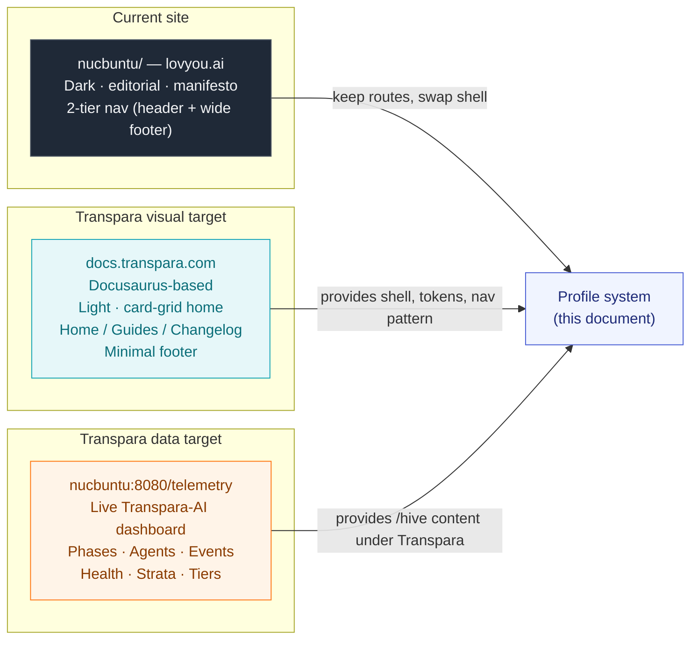
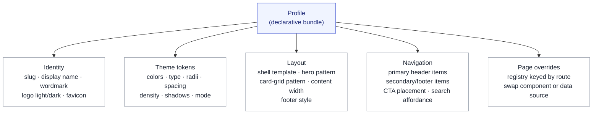
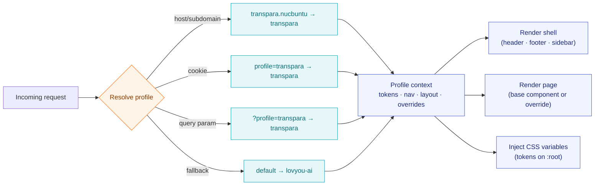
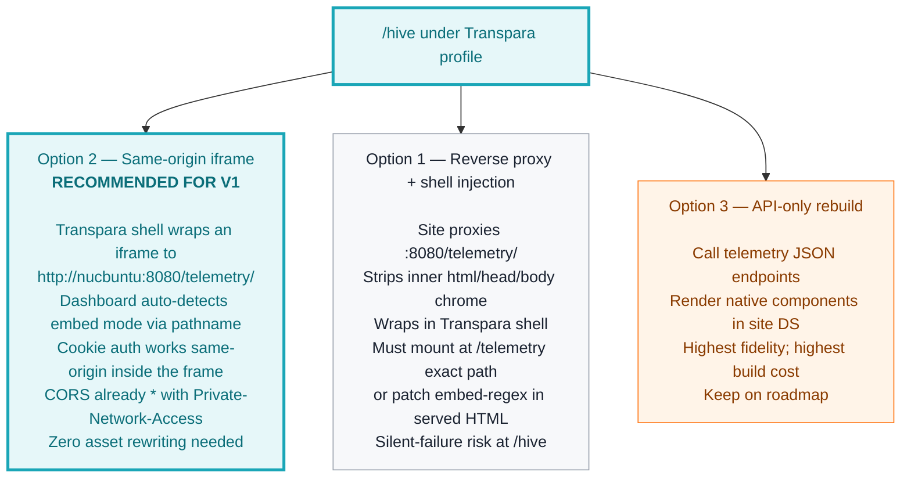

# Display Profile System — Architecture & Strategy

**Version:** 0.3.0 · **Date:** 2026-04-20
**Author:** Claude Opus 4.7
**Owner:** Michael Saucier
**Status:** Design — recon-corrected, ready for Phase 1 implementation
**Versioning:** Versioned as part of the site-profile-redesign set (01–05). Major for structural changes to the profile abstraction; minor for design approach changes; patch for corrections and clarifications.
**Companion:** `01-site-map-discovery.md`, `03-transpara-profile-design.md`, `04-transpara-profile-wireframes.md`, `05-transpara-home-prototype.html`, `06-site-profile-redesign-recon-prompt.md`, `site-profile-redesign-recon-findings-v0.1.0.md`

---

### Revision History

| Version | Date | Description |
|---------|------|-------------|
| 0.1.0 | 2026-04-20 | Initial profile-system design: five-concern profile abstraction (identity · theme · layout · nav · route overrides), request-time resolution flow, 8-step migration plan, three `/hive` wiring options, sequencing estimate (~2–3 weeks), open questions. |
| 0.2.0 | 2026-04-20 | Dark mode support: profile YAML theme block restructured into `light` / `dark` / `shared` palette sub-blocks with `defaultMode`, `toggle`, and `persistence` keys. Added `themeToggle: true` to nav config. Comparison table (§10) gained a Theme model row. |
| 0.2.1 | 2026-04-20 | Added standard Transpara frontmatter and revision history table. No content change. |
| 0.3.0 | 2026-04-20 | Recon corrections: **§7 `/hive` wiring recommendation flipped** from Option 1 (reverse proxy + shell injection) to Option 2 (iframe to `work:8080/telemetry/`) — the dashboard's hard-coded embed-detection regex `/\/telemetry\/?$/` makes Option 1 a silent-failure footgun at `/hive`. Iframe wins on CORS (already `*`), cookies (same-origin inside frame), embed detection (pathname matches natively), and asset rewriting (none needed). **§6 migration plan expanded**: profile scope now covers all three chrome surfaces (public / `/app` / `/hive`) per CEO decision; Tailwind build step added to Phase 1 (replacing in-browser CDN with a real CSS file); Phase 1 token-extraction scope reduced (site already has a 12-token `@theme` block). **§4 YAML updated**: `routeOverrides."/hive"` now `iframe()` not `proxy()`. **§10 table updated**: `/hive` row now captures both lovyou-ai (Phase Timeline) and Transpara (iframe to work-server) realities. Sequencing re-estimate: ~3–4 weeks for full-refactor scope. |

---

> **Purpose.** Define the profile-system abstraction that lets the site at `http://nucbuntu/` host multiple visual identities — today **lovyou-ai**, tomorrow **Transpara**, later others — without forking routes or duplicating pages.
>
> **Key idea.** A display profile is a *presentation-layer bundle* that is orthogonal to routes and data. The URL space, the data sources, and the component tree do not change between profiles. Only the shell, tokens, navigation, and a small page-override registry do.

---

## 1. Executive summary

The site is today a single-theme, manifesto-driven web presence for **lovyou.ai**. Routes, data, and layout are all hand-authored against one visual language. We want to keep the routes and the data, and make the **look, layout, logos, and navigation** swappable per profile.

The first new profile, **Transpara**, is modelled on `https://docs.transpara.com` — a light, docs-style shell — and reuses the existing live dashboard at `http://nucbuntu:8080/telemetry` as its `/hive` page.

The key idea: a profile is a declarative bundle of identity, theme tokens, layout, nav, and a small route-override registry. The URL space and the data layer do not change between profiles — only presentation does.

---

## 2. The three sources



### What each source contributes

- **lovyou-ai (current) — nucbuntu.** Dark, editorial, manifesto-driven. Two-tier nav (header: Discover / Hive / Agents / Blog / My Work — footer adds Market, Knowledge, Activity, Search, Reference, GitHub). Routes are content-driven and already templated; `/app/<space>/<view>` is a shell, and most marketing pages are prose.
- **docs.transpara.com.** Docusaurus-based, clean and corporate. Top navbar with a small square logo + wordmark, three top-level items (Home / Guides / Changelog), a visible search box (`ctrl-K`), a single-column hero with a banner strip (*"Explore the new Transpara Platform"*), and a grid of card links below (Get started, Using Visual KPI, Design, Interfaces, Setup and Installation, Tutorial, FAQ). Footer is a single copyright line. Light background, neutral text, restrained accent color, sans-serif throughout.
- **`nucbuntu:8080/telemetry`.** Already titled *"Transpara-AI — Telemetry"*. A live dashboard: Expansion Phases, Agent Status (12 agents), Hive Health (event rate, severity, mode), Event Stream, Concept Stack, Repository Strata, Role Tiers, Governance, plus a connect-API modal. Ideal substrate for the Transpara profile's `/hive`.

---

## 3. The profile abstraction

A profile is a declarative object with five concerns:



Selection happens **once at request time** (subdomain, query param `?profile=transpara`, cookie, or host header) and is exposed to every page via a single context. Everything else is CSS variables and small conditionals.

---

## 4. Concrete shape of a profile

Conceptually (pseudocode, not committing to a framework):

```yaml
profile: transpara
  identity:
    name: "Transpara"
    wordmark: "Transpara"
    logoLight: /brand/transpara/logo.svg
    logoDark:  /brand/transpara/logo-dark.svg
    favicon:   /brand/transpara/favicon.ico
  theme:
    defaultMode: light         # light · dark · system
    toggle: true               # render theme toggle in header
    persistence: localStorage  # key: transpara.theme
    light:
      --bg:           "#ffffff"
      --surface:      "#f7f8fa"
      --surface-alt:  "#eef0f3"
      --text:         "#1a2230"
      --text-muted:   "#5b6472"
      --border:       "#e6e8ec"
      --primary:      "#1aa6b7"   # Transpara teal/cyan
      --primary-ink:  "#0b6e79"
      --accent:       "#ff7a1a"   # occasional highlight
    dark:
      --bg:           "#0b1220"
      --surface:      "#141c2e"
      --surface-alt:  "#1c2540"
      --text:         "#e4e7ec"
      --text-muted:   "#8891a5"
      --border:       "#232e45"
      --primary:      "#2bc4d6"   # brightened for dark-mode contrast
      --primary-ink:  "#6fdde9"
      --accent:       "#ff914d"   # brightened orange
    shared:
      --radius:       "6px"
      --density:      comfortable
      --font-sans:    "Inter, system-ui, sans-serif"
      --font-mono:    "JetBrains Mono, ui-monospace"
      --font-heading: var(--font-sans)
  layout:
    # Profile covers all three chrome surfaces — full refactor scope
    shells:
      public:  docs-like     # public marketing pages — sidebar on docs routes
      app:     app-dense     # productivity chrome for /app/* — tokens swap, structure preserved
      hive:    iframe-wrap   # thin shell wrapping the work-server dashboard iframe
    contentWidth: 1200
    hero: banner-plus-card-grid
    footer: minimal         # single copyright line
  nav:
    primary:
      - { label: "Home",    route: "/" }
      - { label: "Guides",  route: "/reference" }
      - { label: "Blog",    route: "/blog" }
      - { label: "Hive",    route: "/hive" }
      - { label: "My Work", route: "/app", cta: true }
    search: true
    themeToggle: true       # ← appears in header, between search and CTA
    footerLinks: []         # minimal, like docs.transpara.com
  routeOverrides:
    "/":            TransparaHome                              # banner + 6-card grid
    "/hive":        iframe("http://nucbuntu:8080/telemetry/")  # see §7 — iframe, not proxy
    "/blog/*":      DocsLikeArticle                            # sans-serif, TOC on right
    "/reference/*": DocsLikeArticle
```

The existing profile stays unchanged in substance, but gains the explicit three-shell declaration so the system treats both profiles uniformly:

```yaml
profile: lovyou-ai
  identity: { name: "lovyou.ai", wordmark: "lovyou.ai", logoDark: ... }
  theme:    { mode: dark, tokens: { --bg: "#0b0c0f", --primary: "#d5ff3f", --font-heading: "serif-display", ... } }
  layout:
    shells:
      public: editorial       # current manifesto-driven layout
      app:    app-dense       # same as Transpara — /app is profile-agnostic in structure
      hive:   phase-timeline  # existing live Phase Timeline (no iframe)
    hero: manifesto
    footer: wide
  nav:      { primary: [Discover, Hive, Agents, Blog, My Work], footerLinks: [Market, Knowledge, Activity, Search, Reference, GitHub] }
  routeOverrides: {}        # baseline
```

---

## 5. Request-time profile resolution



---

## 6. Migration plan

```mermaid
flowchart TD
    Step1["1 · Token refactor<br/>Rewrite ~40 hardcoded hex values<br/>to var(--color-...)<br/>12-token @theme block already exists<br/><i>~1–2 days</i>"]
    Step2["2 · Tailwind build step<br/>Replace @tailwindcss/browser CDN<br/>with real Tailwind build<br/>Output real CSS file<br/>Update Dockerfile + deploy.sh<br/><i>~2–3 days</i>"]
    Step3["3 · Profile context<br/>Resolve once per request<br/>Expose profile/tokens/nav/shells/overrides<br/>Default: lovyou-ai"]
    Step4["4 · Abstract THREE shells<br/>Public: ShellEditorial (lovyou) vs ShellDocs (Transpara)<br/>App: ShellAppDense (tokens swap, structure preserved)<br/>Hive: ShellPhaseTimeline (lovyou) vs ShellHiveIframe (Transpara)"]
    Step5["5 · Logo + wordmark component<br/>Resolve from profile.identity<br/>Remove hard-coded 'lovyou.ai' strings"]
    Step6["6 · Route-visibility map<br/>Each route declares<br/>which profiles expose it in which tier"]
    Step7["7 · Page overrides registry<br/>(profile, route) → component | iframe<br/>Falls back to default page if unset"]
    Step8["8 · Build the Transpara profile<br/>All three surfaces (public · app · hive)<br/>Ship behind ?profile=transpara flag<br/>Dark mode toggle included"]
    Step9["9 · Test matrix<br/>Snapshot representative routes × profiles × themes<br/>Lock in visual diffs"]

    Step1 --> Step2 --> Step3 --> Step4 --> Step5 --> Step6 --> Step7 --> Step8 --> Step9

    classDef mech fill:#e6f7f9,stroke:#1aa6b7,color:#0b6e79
    classDef feat fill:#f0f4ff,stroke:#4b5fd4,color:#1e2a78
    classDef ship fill:#fff4e8,stroke:#ff7a1a,color:#8a3b00

    class Step1,Step2,Step3,Step4,Step5 mech
    class Step6,Step7 feat
    class Step8,Step9 ship
```



### Migration notes

1. **Token refactor.** Recon confirms the site already has a 12-token `@theme` block in `views/layout.templ`. The remaining work is rewriting ~15 raw hex values in prose classes + ~25 in `graph/views.templ` to use `var(--color-...)`. Much smaller than originally estimated. *~1–2 days.*
2. **Tailwind build step.** Replace `@tailwindcss/browser` CDN with a real Tailwind build. This is a scope-add per CEO decision: it unlocks proper CSS purging, predictable output, and avoids the FOUC risk of client-side JIT. Touches `Makefile`, `Dockerfile`, `deploy.sh`, and introduces a `static/css/site.css` artifact. *~2–3 days.*
3. **Introduce a Profile context.** Resolve the active profile once per request from host/subdomain/cookie/query. Expose `profile`, `tokens`, `nav`, `shells`, `overrides` to every page. Default: `lovyou-ai`. Plumbs through templ components via a context struct.
4. **Abstract the three shells.** Recon revealed three distinct chrome templates that the profile system must all address:
   - **Public** (`views.Layout`): split into `ShellEditorial` (lovyou-ai dark manifesto) and `ShellDocs` (Transpara docs-like).
   - **App** (`graph.themeBlock + graph.simpleHeader`): one `ShellAppDense` shared across profiles — only tokens swap.
   - **Hive** (`graph.HivePage`): split into `ShellPhaseTimeline` (lovyou-ai Phase Timeline — current) and `ShellHiveIframe` (Transpara thin wrapper hosting iframe to `work:8080/telemetry/`).

   Each shell reads `profile.layout.shells.<surface>` and selects. Header/footer become data-driven from `profile.nav`.
5. **Logo + wordmark component.** One component that resolves the asset from `profile.identity`; remove hard-coded `"lovyou.ai"` strings from templates.
6. **Route-visibility map.** Each route declares which profiles expose it in which nav tier. Routes still exist for everyone — they just aren't advertised if a profile omits them. Applies to user-facing routes only; API/ingest routes in Artifact 01 §7.2 are invisible to the profile system.
7. **Page overrides registry.** A lookup `(profile, route) → component | iframe`. Falls back to the default page if unset. This is how `/hive` gets an iframe under Transpara without touching lovyou-ai's Phase Timeline.
8. **Build the Transpara profile** across all three surfaces: docs-style home + card grid (public), re-themed productivity chrome (`/app/*`), iframe mission-control (`/hive`). Dark mode toggle ships in the header. Initial release behind `?profile=transpara` flag before promoting to a subdomain like `transpara.nucbuntu` or a default for certain hosts.
9. **Test matrix.** Snapshot representative routes × profiles × themes: `/`, `/hive`, `/blog`, `/blog/<post>`, `/reference`, `/discover`, `/app/demo/board` × {lovyou-ai, Transpara} × {light, dark, system}. Lock in visual diffs.

### On `/app/**` under the full-refactor scope

`/app/*` keeps its dense productivity chrome in both profiles — the docs-like shell does not fit the information density. What changes under the Transpara profile is the token palette, the logo, and the theme-toggle surface. Structure stays. This is the pragmatic meaning of "full refactor": the profile system *reaches* all three surfaces, but does not impose the same shell template on all three.

---

## 7. The Transpara `/hive`: wiring to telemetry

`http://nucbuntu:8080/telemetry/` is a complete Transpara-AI mission-control dashboard (phases, agent status, event stream, hive health, concept stack, repository strata, role tiers, governance), served by `work` and embedded into its binary via `//go:embed`. Recon (v0.1.0 findings) reveals specific constraints that change the calculus from the v0.2.1 draft.



### Why Option 2 wins (recon findings)

The dashboard at `summary/dashboard.html` (3453 lines, self-contained, zero external asset dependencies) has a hard-coded embed-detection regex in its own JavaScript:

```javascript
var embedded = /\/telemetry\/?$/.test(window.location.pathname);
var API_BASE = embedded ? window.location.origin : params.get("api");
var API_KEY  = embedded ? null : params.get("key");
var USE_COOKIE_AUTH = embedded;
```

- In **iframe mode** (Option 2), the iframe's own `window.location.pathname` is `/telemetry/` on the work-server origin. Regex matches. Embed mode triggers. Cookie auth works because `ws_key` is set `SameSite=Strict` on the work-server origin, and the iframe's fetches are to its own origin. **Everything just works.**
- In **reverse-proxy mode at `/hive`** (Option 1), the browser sees `window.location.pathname === "/hive"`. Regex misses. The dashboard silently falls into config-card mode asking for API URL and key. No server error, no log line — just a broken page that looks live.

Option 1 becomes viable only if the proxy mounts at `/telemetry` *exactly* (overlapping existing route space) or if the served HTML is rewritten to patch the regex (touches a shared artifact across three repos — risky). Neither is worth the complexity when Option 2 works today.

### Additional Option 2 advantages

- **CORS already configured.** Work-server emits `Access-Control-Allow-Origin` echo + `Access-Control-Allow-Private-Network: true` globally.
- **No asset rewriting.** The dashboard is a single self-contained HTML file with zero external `<link>` / `<script src>` references.
- **Auth is already cookie-based.** Work-server sets `ws_key` cookie (`HttpOnly, SameSite=Strict`) on the dashboard GET; subsequent API calls carry it automatically via `withCredentials: true` in the dashboard's fetch logic.

### Theme coupling limitation

The embedded dashboard renders in its own color scheme, which does **not** follow the Transpara profile's theme toggle. Under Transpara dark mode with a light dashboard inside, the seam is visible. Two future options:

1. **Pass `?theme=light|dark`** to the iframe URL; dashboard reads it and swaps its internal palette. Requires a work-server PR to `work/dashboard/dashboard.html` (also affects `summary/dashboard.html` since they're byte-identical copies).
2. **Accept the seam for v1** and document it as a roadmap item. The iframe boundary is visually explicit, so users understand they're looking at an embedded system.

Recommendation: ship Option 2 with the seam, file a roadmap issue for dashboard theme-param support.

### Lovyou-ai `/hive` is unaffected

Under the lovyou-ai profile, `/hive` keeps its current live Phase Timeline page (DB + hive loop state + recent commits via `git log`). No iframe, no proxy, no changes. The profile's `routeOverrides` mechanism swaps implementations cleanly: `(transpara, /hive) → iframe wrapper`; `(lovyou-ai, /hive) → existing handleHive`.

---

## 8. Sequencing

| Phase | Work | Duration |
|-------|------|----------|
| **1** | Token refactor — ~40 hex values rewritten to `var(--color-...)` | 1–2 days |
| **2** | Tailwind build step — replace CDN with real build + CSS file | 2–3 days |
| **3** | Profile context — resolve once per request, plumb through templ | 2–3 days |
| **4** | Three-shell abstraction — public (editorial vs docs), app, hive (phase-timeline vs iframe) | 3–5 days |
| **5** | Logo + wordmark component, route-visibility map, overrides registry | 2–3 days |
| **6** | Build Transpara profile — all three surfaces, dark mode toggle | 5–7 days |
| **7** | `/hive` iframe wiring — thin wrapper, cookie auth flow verification | 1–2 days |
| **8** | Test matrix — routes × profiles × themes snapshots | 2 days |
| **Total** | Full-refactor scope across three chrome surfaces with both profiles + dark mode | **~3–4 weeks** |

---

## 9. Open questions

Questions resolved by CEO decisions on 2026-04-20 are marked ✓. Still-open items follow.

**Resolved:**

- ✓ **`/hive` semantics under Transpara** — replace Phase Timeline with Mission Control iframe. Phase Timeline stays under lovyou-ai profile.
- ✓ **Profile system scope** — covers all three chrome surfaces (public, `/app`, `/hive`). Full-refactor scope.
- ✓ **Tailwind strategy** — introduce a proper Tailwind build step in Phase 1. Output a real CSS file; retire the browser-JIT CDN.
- ✓ **Telemetry co-location** — recon confirms work-server runs on nucbuntu at `:8080`, reachable via loopback from the site server. Iframe wiring works today.

**Still open — decisions needed before Phase 6:**

1. **Profile selection in production** — subdomain (`transpara.nucbuntu` vs `lovyou.nucbuntu`), host header, cookie, or query param? This changes the plumbing in Step 3. Default proposal: query param `?profile=transpara` for v1 testing, promote to subdomain for GA.
2. **Transpara brand assets** — logo / wordmark / favicon: ready assets, or plain text wordmark + placeholder mark for v1? The HTML prototype (Artifact 05) ships with a procedural "T" mark as a placeholder.
3. **Dashboard theme coupling** — the embedded Mission Control dashboard renders in its own fixed color scheme and does not follow the Transpara theme toggle. Accept the seam for v1, or prioritize a work-server PR to support `?theme=light|dark` on the dashboard URL?
4. **Lovyou-ai explicit shell declarations** — the updated profile YAML (§4) now shows `shells: { public: editorial, app: app-dense, hive: phase-timeline }` for lovyou-ai. The `app-dense` and `phase-timeline` shell names are new labels; no code change required for lovyou-ai, just explicit naming. Confirm this naming is acceptable.
5. **Cleanup fallout** — `summary/.github/workflows/deploy.yml` still POSTs to the removed `/telemetry/refresh` endpoint. File an issue now, or defer?

---

## 10. What is intentionally different vs. lovyou-ai

The contrast should be visible at a glance:

| Aspect | lovyou-ai | Transpara |
|--------|-----------|-----------|
| **Theme model** | Dark only, no toggle | Light default + dark + system, with toggle |
| **Background** | Near-black | White (light) / deep navy `#0b1220` (dark) |
| **Hero** | Three layered CTAs over a manifesto | Single quiet CTA |
| **Nav breadth** | 5 primary + 10 footer | 4 primary + search + toggle + CTA; footer-minimal |
| **`/hive`** | Live Phase Timeline (HTMX-polled, DB + hive loop state + git log) | Iframe to `work:8080/telemetry/` — embedded Mission Control dashboard |
| **Typography** | Editorial serif display for headlines | Inter throughout |
| **Density** | Spacious (editorial) | Comfortable-tight (docs) |
| **Tone** | Philosophical / manifesto | Operational / product |

---

## 11. Next artifacts

This document defines **how** the profile system works. Two companion artifacts cover the **what** for the Transpara profile:

- **Transpara Profile — Design Specification** — shell, tokens, typography, route-by-route look-and-feel.
- **Transpara Profile — Wireframes** — ASCII wireframes fixing the home page, `/hive`, and shared shell structure.
