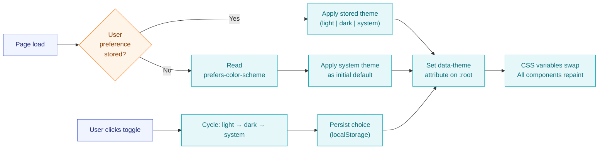
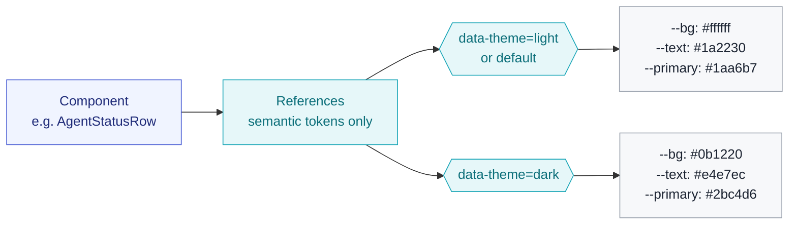
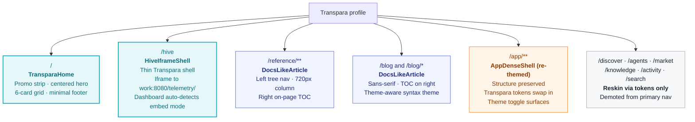

# Transpara Profile — Design Specification

**Version:** 0.3.0 · **Date:** 2026-04-20
**Author:** Claude Opus 4.7
**Owner:** Michael Saucier
**Status:** Design — recon-corrected, ready for Phase 1 implementation
**Versioning:** Versioned as part of the site-profile-redesign set (01–05). Major for structural changes to the profile visual contract; minor for design approach changes; patch for corrections and clarifications.
**Companion:** `01-site-map-discovery.md`, `02-display-profile-system.md`, `04-transpara-profile-wireframes.md`, `05-transpara-home-prototype.html`, `06-site-profile-redesign-recon-prompt.md`, `site-profile-redesign-recon-findings-v0.1.0.md`

---

### Revision History

| Version | Date | Description |
|---------|------|-------------|
| 0.1.0 | 2026-04-20 | Initial Transpara profile specification: single light palette anchored on docs.transpara.com, shell structure, navigation, route-by-route treatment, component catalog, pasteable token sheet, one-glance acceptance test. |
| 0.2.0 | 2026-04-20 | Dark mode support: dual palette (§2.1 light, §2.2 dark on deep navy `#0b1220`), new §3 "Theme system" with resolution flow + component/palette decoupling diagram + three-state toggle spec, theme-aware component catalog (§7), expanded token sheet (§8) with both palettes and anti-FOUC inline script, dark-mode checklist added to acceptance test (§10), dark mode removed from "not in scope". |
| 0.2.1 | 2026-04-20 | Added standard Transpara frontmatter and revision history table. No content change. |
| 0.3.0 | 2026-04-20 | Recon corrections: **§6.2 `/hive` treatment rewritten** — now an iframe boundary rather than a proxied/injected dashboard; Transpara shell wraps an iframe to `work:8080/telemetry/`; dashboard's hard-coded embed-detection regex and cookie-auth flow explained. **§6.5 `/app` upgraded** from "reskin only" to full profile participation (tokens swap, structure preserved — productivity UI keeps its density). **§7 component catalog** gained `HiveIframeShell`; dropped `StatCard`, `PhaseList`, `AgentStatusRow`, `EventStreamItem`, `TabbedInspector` (dashboard internals, not site components). **§10 acceptance test** gained iframe-specific checks and the dashboard-theme-seam note. **§11 not-in-scope** cleanup: removed "full refactor of `/app/**` deferred"; added "dashboard `?theme=` query param support" as roadmap item. |

---

> **Purpose.** Concretize the look-and-feel of the **Transpara** display profile for the site at `http://nucbuntu/`. Anchored in `docs.transpara.com` for visual language, with `/hive` backed by the live telemetry dashboard at `http://nucbuntu:8080/telemetry`.
>
> **Themes.** The profile ships with **both light and dark themes** plus a user-facing toggle. Light is the default to mirror docs.transpara.com. Dark mode is designed for control-room and long-session viewing, where true-black is a mistake and deep navy is the correct answer.
>
> **Companion artifacts.** Site map (Artifact 1), profile-system architecture (Artifact 2), wireframes (Artifact 4). This document defines the visual contract; the wireframes show how it lays out on the page.

---

## 1. Design intent

The Transpara profile should read as a **docs-grade operational product**, not a manifesto. Users should arrive on `/` and know within one second: *this is a serious product site with a live running system behind it*. Three signals land that feeling:

1. A **docs-style shell** — light (or dark) background, small logo + wordmark, restrained nav, single primary CTA, minimal footer. Mirrors `docs.transpara.com`.
2. A **live `/hive`** — the telemetry dashboard, not an editorial page. The hive is running right now, the numbers are real, and the profile puts that front and centre.
3. A **first-class theme toggle** — because industrial operators work in control rooms, executives review on tablets, and everyone hates eye-burn at 2am. Light and dark are both full citizens.

Everything else follows from those three choices.

---

## 2. Visual identity & theme tokens

The Transpara profile defines **one set of semantic tokens** (`--bg`, `--text`, `--primary`, etc.) and **two palettes** (light, dark) bound to those tokens. Components only ever reference the semantic tokens — they never know which theme is active. This is what makes the toggle a one-line operation instead of a refactor.

### 2.1 Light palette — default

| Token | Value | Role |
|-------|-------|------|
| `--bg` | `#ffffff` | Page background |
| `--surface` | `#f7f8fa` | Elevated surfaces (cards, sidebars, table rows) |
| `--surface-alt` | `#eef0f3` | Hover / pressed state on surfaces |
| `--text` | `#1a2230` | Primary text |
| `--text-muted` | `#5b6472` | Secondary text, captions |
| `--border` | `#e6e8ec` | Dividers, card outlines |
| `--primary` | `#1aa6b7` | Transpara teal/cyan — links, CTAs |
| `--primary-ink` | `#0b6e79` | Darker teal for hover / emphasis |
| `--accent` | `#ff7a1a` | Occasional highlight — *"Live"* badges, processing states |
| `--focus` | `#1aa6b7` at 40% alpha | Keyboard focus ring |

### 2.2 Dark palette

Deep navy base (not true-black), brightened primary for contrast, slightly warmer accent. Designed for long dashboard viewing.

| Token | Value | Role |
|-------|-------|------|
| `--bg` | `#0b1220` | Deep navy — page background |
| `--surface` | `#141c2e` | Elevated surfaces |
| `--surface-alt` | `#1c2540` | Hover / pressed state, popovers |
| `--text` | `#e4e7ec` | Primary text — high contrast, not pure white |
| `--text-muted` | `#8891a5` | Secondary text, captions |
| `--border` | `#232e45` | Dividers, card outlines |
| `--primary` | `#2bc4d6` | Brightened teal — maintains contrast on navy |
| `--primary-ink` | `#6fdde9` | Lighter teal for hover / emphasis |
| `--accent` | `#ff914d` | Brightened orange — "Live" badges, processing states |
| `--focus` | `#2bc4d6` at 50% alpha | Keyboard focus ring |

### 2.3 Shared tokens (theme-independent)

These do not change between themes.

| Token | Value | Role |
|-------|-------|------|
| `--radius` | `6px` | Default corner radius |
| `--density` | `comfortable` | Slightly denser than lovyou-ai |
| `--font-sans` | `"Inter", system-ui, sans-serif` | Body + headings |
| `--font-mono` | `"JetBrains Mono", ui-monospace` | Code blocks, metric values |
| `--font-heading` | `var(--font-sans)` | **No editorial serif** — same Inter family |
| `--space-1…7` | `4 · 8 · 12 · 16 · 24 · 32 · 48 px` | Spacing scale |
| `--header-height` | `56px` | Top navbar |
| `--promo-height` | `36px` | Optional promo strip |
| `--content-max` | `1200px` | Content column max-width |
| `--article-max` | `720px` | Long-form article column |
| `--sidebar-width` | `260px` | Docs sidebar |

---

## 3. Theme system (light/dark toggle)

### 3.1 Resolution order



### 3.2 Behavior rules

- **First visit with no stored preference** — respect `prefers-color-scheme` from the OS. If the user's OS is dark, the site loads dark.
- **User clicks toggle** — cycles through three states: `light → dark → system`. *System* means "follow OS preference, update live if it changes". This is the same pattern GitHub, Vercel, Linear, and docs.transpara.com's peers all use.
- **Persistence** — the user's choice lives in `localStorage` under a namespaced key (`transpara.theme`). Cookies are acceptable if SSR theming is required (avoids FOUC on first paint).
- **No theme flash on load** — a tiny inline script in `<head>` reads the stored value and sets `data-theme` **before** the stylesheet renders. This is a ~500-byte inline script; the cost of getting it wrong is a very ugly white-to-dark flash on every page load.
- **Persistence is per-profile** — the lovyou-ai profile has no toggle and stays dark. Storing a Transpara preference does not affect lovyou-ai. Keys are namespaced.

### 3.3 Toggle UI

A single icon button in the header, right-aligned, immediately before the `My Work` CTA. Icon reflects the **current active theme**:

| State | Icon | Tooltip |
|-------|------|---------|
| Light active | ☀ (sun) | *"Light · click to switch to dark"* |
| Dark active | ☾ (moon) | *"Dark · click to switch to system"* |
| System active | 🖥 (monitor) — or a half-filled icon | *"System · click to switch to light"* |

Click cycles: `light → dark → system → light`. Keyboard accessible (focus ring uses `--focus`). Transitions: 180ms ease on `background-color`, `color`, and `border-color` across every component — smooth, not jarring.

### 3.4 One set of components, two palettes



Components never reference raw hex values or theme-specific names. `background: var(--bg)`, not `background: white` or `background: var(--light-bg)`. This is the rule.

---

## 4. Shell structure (shared by all Transpara pages)

```
╔════════════════════════════════════════════════════════════════════════════╗
║  HEADER  56px    logo+wordmark │ primary nav │ search │ [☾] │ CTA          ║  profile.nav.primary + theme toggle
╠════════════════════════════════════════════════════════════════════════════╣
║  (optional) promo strip 36px                                               ║  only on /, dismissible
╠══════════════════════════════════╦═════════════════════════════════════════╣
║  SIDEBAR (doc routes only)       ║  CONTENT max-width 1200px, gutters 24   ║
║   • Section A                    ║                                         ║
║     · page                       ║   <page content>                        ║
║     · page ▓                     ║                                         ║
║   • Section B                    ║   right-side on-page TOC on /reference  ║
║                                  ║   and long /blog posts (sticky)         ║
╠══════════════════════════════════╩═════════════════════════════════════════╣
║  FOOTER   © · GitHub · Status                                              ║  profile.layout.footer=minimal
╚════════════════════════════════════════════════════════════════════════════╝
```

**Sidebar visibility rules.** Appears automatically on `/reference/**` and long-form `/blog/*`. Collapses away on `/`, `/hive`, `/discover`, `/agents`, `/app/**`.

**Theme toggle placement.** Right-aligned in the header, between the search affordance and the `My Work` CTA. Never in a hamburger menu on desktop. On mobile (< 768px) it may fold into the overflow menu alongside search.

---

## 5. Navigation

### 5.1 Primary nav (header, left → right)

| Item | Route | Notes |
|------|-------|-------|
| Logo + wordmark | `/` | Clickable, returns home |
| Home | `/` | Text link |
| Guides | `/reference` | Docs-style article layout |
| Blog | `/blog` | Docs-style article layout |
| Hive | `/hive` | Iframe to `work:8080/telemetry/` — Mission Control dashboard |
| Search | `/search` | Visible input with `⌘K` affordance |
| **Theme toggle** | — | Icon button, cycles light / dark / system |
| **My Work** | `/app` | Primary CTA, right-aligned |

### 5.2 Footer

Single line: **© 2026 Transpara · GitHub · Status**. Nothing else.

Secondary surfaces (`/market`, `/knowledge`, `/activity`, `/agents`, `/discover`) stay reachable via search or deep links, but do **not** earn footer real estate under Transpara.

---

## 6. Route-by-route treatment



### 6.1 `/` — Home

- Thin accent banner strip (*"Explore the live Hive — 12 agents running right now →"*).
- Centered hero: **H1** + subtitle + **single** *"Get started"* button pointing at `/app`. No imagery in v1.
- 6-card grid: Using the platform, Design, Interfaces, Setup & Installation, Tutorial, FAQ.

### 6.2 `/hive` — Mission Control (iframe)

Under the Transpara profile, `/hive` is a **thin Transpara shell wrapping an iframe** to `http://nucbuntu:8080/telemetry/`. The outer chrome (header, theme toggle, footer) belongs to the site; the inner content is the embedded Mission Control dashboard owned by `lovyou-ai-work`.

**Implementation components:**

- **Outer shell: `HiveIframeShell`** — Transpara nav + page header strip (title + live indicator + host string) + iframe + minimal footer.
- **Iframe target:** `http://nucbuntu:8080/telemetry/` (trailing slash required — the dashboard's embed-detection regex is `/\/telemetry\/?$/`).
- **Iframe attributes:** `width="100%"`, `height="100%"`, `loading="lazy"`, `allow="clipboard-write"`, no `sandbox` (dashboard needs cookies for auth).

**Why iframe and not proxy:** the dashboard's JavaScript hard-codes embed detection to the `/telemetry` pathname. A reverse proxy mounted at `/hive` breaks embed detection silently — the browser sees `/hive`, the regex misses, and the dashboard renders a config card asking for API URL and key. Iframe mode keeps the iframe's own pathname as `/telemetry/` on the work-server origin, so embed mode triggers naturally. See Artifact 02 §7 for the full rationale.

**Auth flow:**
1. User navigates to Transpara `/hive`.
2. Site shell renders with iframe pointing at `work:8080/telemetry/`.
3. Browser issues `GET /telemetry/` to work-server. Work-server sets `ws_key` cookie (`HttpOnly`, `SameSite=Strict`) on the work-server origin and returns the dashboard HTML.
4. Dashboard JS sees its own pathname matches the regex, enables embed mode, fetches `/telemetry/status` and `/telemetry/sse` on its own origin with `withCredentials: true`.
5. Cookie auth carries the key through every subsequent request.

**Theme coupling caveat (honest about the seam):**

The embedded dashboard has its own color scheme baked into its inlined CSS. It does **not** follow the Transpara theme toggle. Under Transpara dark mode with a light dashboard inside (or vice versa), the boundary is visible at the iframe edge. Two paths to fix (both deferred):

1. Add a `?theme=light|dark` query param to the iframe URL. Requires a PR to `lovyou-ai-work/dashboard/dashboard.html` (+ its byte-identical copy in `lovyou-ai-summary/dashboard.html`) to read the param and swap its internal palette.
2. Match the Transpara shell's accent color to the dashboard's existing palette so the seam looks intentional. Cosmetic-only.

For v1, accept the seam. File a roadmap issue against `lovyou-ai-work`.

**Transpara shell chrome around the iframe:**

- Full-bleed header (56px) — same top navbar as every other Transpara page, with `/hive` marked active.
- Page header strip (thin, ~40px) — *"Transpara-AI · Mission Control"* title, live dot, wall-clock time, host string (`nucbuntu:8080`).
- Iframe fills the remaining viewport.
- Minimal single-line footer.

**Lovyou-ai profile is unaffected.** Under lovyou-ai, `/hive` keeps its current live Phase Timeline (DB + hive loop state + `git log`). No iframe, no proxy. The profile override registry swaps implementations cleanly.

### 6.3 `/blog` and `/blog/*` — Docs-style articles

- Left sidebar with tree nav (sections: Foundation, Thirteen Graphs, Consciousness, Application, Grammar, Building).
- Content column capped at ~720px.
- Right-side on-page TOC (sticky).
- Anchor links on headings.
- Monospaced code blocks with a **theme-aware syntax highlighter** — swap Shiki/Prism themes on toggle (e.g. `min-light` ↔ `one-dark-pro`).
- Sans-serif body + headings (Inter). **No editorial serif.**

### 6.4 `/reference/**` — Docs-style articles

Same layout as `/blog/*`. Left tree nav reflects the reference taxonomy:

- Cognitive Grammar
- Higher-Order Operations
- Grammar / Grammars
- Code Graph
- Agents
- Layers 0–9

### 6.5 `/app/**` — Full profile participation

Under the Transpara profile, `/app/*` pages use the **`AppDenseShell`** template — the same structural layout as lovyou-ai's `graph.themeBlock + graph.simpleHeader`, but with Transpara tokens swapped in and the theme toggle surfaced in the header.

**What changes under Transpara:**
- Palette swaps to Transpara tokens (teal primary, Inter typography, light-default/dark-optional).
- Logo + wordmark in the app header come from `profile.identity`.
- Theme toggle surfaces in the app header alongside whatever controls already exist there.
- Focus rings, selection colors, and hover states use the Transpara `--focus` and `--primary` tokens.

**What stays the same:**
- Information density — `/app/*` is productivity software. Dashboard-style whitespace does not fit.
- Component structure — boards, feeds, people lists, threads, knowledge pages keep their current layouts.
- Interaction patterns — HTMX polling, command palette (`⌘K`), keyboard shortcuts (`G+B/F/C/A/K`), drag-and-drop on kanban.

This is the pragmatic meaning of "full profile participation" from the CEO's scope decision: the profile system *reaches* `/app/*`, but does not impose the docs-like shell on it. The productivity UI is too different from the marketing surfaces to share a template, and forcing the issue would reduce density below what operators need.

### 6.6 Secondary surfaces

`/discover`, `/agents`, `/market`, `/knowledge`, `/activity`, `/search` — reuse existing components, reskinned via tokens. Demoted from primary nav.

---

## 7. Component catalog (Transpara-specific)

| Component | Role | Theme-aware? |
|-----------|------|--------------|
| `Navbar` | 56px top bar — logo+wordmark, 4 primary links, search, **toggle**, CTA | ✓ via tokens |
| `ThemeToggle` | Icon button cycling light / dark / system; persists choice | **is the toggle** |
| `PromoStrip` | Dismissible 36px accent banner on `/` | ✓ |
| `HeroCentered` | H1 + subtitle + single CTA, centered | ✓ |
| `CardGrid` | 3×2 card grid on `/` | ✓ (card bg = `--surface`) |
| `DocsSidebar` | Left tree nav for `/reference/**` and long `/blog/*` | ✓ |
| `OnPageTOC` | Sticky right-side TOC, populated from headings | ✓ |
| `HiveIframeShell` | Thin Transpara shell wrapping an iframe to `work:8080/telemetry/` — page-header strip with title, live dot, wall clock, host; iframe fills the body | ✓ for the shell chrome; iframe content is theme-fixed (see §6.2) |
| `AppDenseShell` | Productivity chrome for `/app/*` — equivalent to lovyou-ai's `graph.themeBlock + simpleHeader`, tokens swap per profile | ✓ |
| `CodeBlock` | Monospace code with syntax highlighting | ✓ — swap syntax theme on toggle |
| `FooterMinimal` | Single line: © · GitHub · Status | ✓ |

The dashboard internals (`StatCard`, `PhaseList`, `AgentStatusRow`, `EventStreamItem`, `TabbedInspector`) belong to `lovyou-ai-work/dashboard/dashboard.html` and are **not** site components. Under the Transpara profile, these render inside the iframe from their original codebase. The site does not reimplement them.

---

## 8. Token sheet (CSS custom properties)

Ready to paste. Default is light; `[data-theme="dark"]` overrides swap the palette. Initial theme may also come from `prefers-color-scheme` if the user has not set a preference.

```css
/* ─── Transpara profile — base tokens ─────────────────────────── */
:root[data-profile="transpara"] {
  /* Shape */
  --radius:           6px;

  /* Type */
  --font-sans:        "Inter", system-ui, -apple-system, Segoe UI, Roboto, sans-serif;
  --font-mono:        "JetBrains Mono", ui-monospace, SFMono-Regular, Menlo, monospace;
  --font-heading:     var(--font-sans);

  /* Space */
  --space-1: 4px;  --space-2: 8px;   --space-3: 12px;  --space-4: 16px;
  --space-5: 24px; --space-6: 32px;  --space-7: 48px;

  /* Chrome */
  --header-height:    56px;
  --promo-height:     36px;
  --content-max:      1200px;
  --article-max:      720px;
  --sidebar-width:    260px;

  /* Transitions — theme swap is smooth, not jarring */
  --theme-transition: background-color 180ms ease, color 180ms ease, border-color 180ms ease;
}

/* ─── Light palette (default) ─────────────────────────────────── */
:root[data-profile="transpara"],
:root[data-profile="transpara"][data-theme="light"] {
  --bg:           #ffffff;
  --surface:      #f7f8fa;
  --surface-alt:  #eef0f3;
  --text:         #1a2230;
  --text-muted:   #5b6472;
  --border:       #e6e8ec;
  --primary:      #1aa6b7;
  --primary-ink:  #0b6e79;
  --accent:       #ff7a1a;
  --focus:        rgba(26, 166, 183, 0.4);
  color-scheme:   light;
}

/* ─── Dark palette ────────────────────────────────────────────── */
:root[data-profile="transpara"][data-theme="dark"] {
  --bg:           #0b1220;
  --surface:      #141c2e;
  --surface-alt:  #1c2540;
  --text:         #e4e7ec;
  --text-muted:   #8891a5;
  --border:       #232e45;
  --primary:      #2bc4d6;
  --primary-ink:  #6fdde9;
  --accent:       #ff914d;
  --focus:        rgba(43, 196, 214, 0.5);
  color-scheme:   dark;
}

/* ─── System preference when user has not chosen ─────────────── */
@media (prefers-color-scheme: dark) {
  :root[data-profile="transpara"]:not([data-theme]),
  :root[data-profile="transpara"][data-theme="system"] {
    --bg:           #0b1220;
    --surface:      #141c2e;
    --surface-alt:  #1c2540;
    --text:         #e4e7ec;
    --text-muted:   #8891a5;
    --border:       #232e45;
    --primary:      #2bc4d6;
    --primary-ink:  #6fdde9;
    --accent:       #ff914d;
    --focus:        rgba(43, 196, 214, 0.5);
    color-scheme:   dark;
  }
}

/* ─── Smooth theme transitions ────────────────────────────────── */
:root[data-profile="transpara"] *,
:root[data-profile="transpara"] *::before,
:root[data-profile="transpara"] *::after {
  transition: var(--theme-transition);
}
```

### Anti-FOUC inline script

Ships in `<head>` before the stylesheet to avoid a theme flash on initial paint:

```html
<script>
  (function () {
    try {
      var stored = localStorage.getItem('transpara.theme');
      var theme = stored || 'system';
      document.documentElement.setAttribute('data-profile', 'transpara');
      if (theme !== 'system') {
        document.documentElement.setAttribute('data-theme', theme);
      }
    } catch (e) { /* no-op */ }
  })();
</script>
```

---

## 9. What is intentionally different vs lovyou-ai

The contrast is visible at a glance:

| Aspect | lovyou-ai | Transpara |
|--------|-----------|-----------|
| **Theme model** | Dark only, no toggle | Light default + dark + system, with toggle |
| **Background** | Near-black | White (light) / deep navy `#0b1220` (dark) |
| **Hero** | Three layered CTAs over a manifesto | Single quiet CTA |
| **Nav breadth** | 5 primary + 10 footer | 4 primary + toggle + CTA; footer-minimal |
| **`/hive`** | Live Phase Timeline (HTMX-polled) | Iframe to `work:8080/telemetry/` — Mission Control dashboard |
| **Typography** | Editorial serif display for headlines | Inter throughout |
| **Density** | Spacious (editorial) | Comfortable-tight (docs) |
| **Tone** | Philosophical / manifesto | Operational / product |
| **Footer** | Wide, 10 links | Minimal, single line |

---

## 10. One-glance acceptance test

The profile has landed when all of the following are true.

**On the home page (light theme):**
- [ ] Page background is white.
- [ ] Only one CTA button in the hero.
- [ ] No serif display type anywhere.
- [ ] 6 cards visible in a 3×2 grid below the hero.
- [ ] Nav has exactly 4 primary items + search + theme toggle + `My Work` CTA.
- [ ] Footer is one single line.
- [ ] Search affordance visible in the header (not hidden behind a hamburger).

**On `/hive` (Transpara profile):**
- [ ] Transpara nav header + page-header strip visible above the iframe.
- [ ] Iframe loads `http://nucbuntu:8080/telemetry/` (check the src attribute in DevTools).
- [ ] Dashboard renders in embed mode — no config card asking for API URL or key.
- [ ] Cookie `ws_key` set on the work-server origin (visible in DevTools Application → Cookies).
- [ ] Network tab shows live SSE connection to `/telemetry/sse` on the work-server origin.
- [ ] Site theme toggle still works and re-themes the Transpara shell around the iframe.
- [ ] Dashboard content inside the iframe does NOT follow the toggle — documented seam (see §6.2).
- [ ] Lovyou-ai profile `/hive` unchanged — still renders Phase Timeline, not an iframe.

**Theme toggle:**
- [ ] Toggle icon is visible in the header on every page.
- [ ] Clicking toggle switches theme in under 200ms with smooth color transitions.
- [ ] Toggle cycles through three states: light → dark → system → light.
- [ ] Icon reflects the active state (sun / moon / monitor).
- [ ] Choice persists across page loads (localStorage).
- [ ] First visit with `prefers-color-scheme: dark` loads dark automatically.
- [ ] No white-flash on page load in dark mode (anti-FOUC script is doing its job).

**In dark mode specifically:**
- [ ] Background is deep navy `#0b1220`, **not** true black.
- [ ] Primary teal appears brighter (`#2bc4d6`), still recognizably Transpara.
- [ ] Text contrast meets WCAG AA — check with a tool, not with vibes.
- [ ] Status colors on `/hive` (Good / Warning / Processing) remain legible against the dark surface.
- [ ] Code blocks in `/blog/*` and `/reference/**` use a dark syntax theme (e.g. one-dark-pro).

---

## 11. Not in scope for v1

- High-contrast accessibility theme (beyond WCAG AA).
- User-adjustable accent color beyond the default teal.
- Per-page theme overrides (e.g. `/hive` always dark regardless of user preference).
- API-only rebuild of `/hive` (Option 3 from Artifact 02 §7 — kept as a roadmap alternative if iframe constraints become painful).
- Dashboard `?theme=light|dark` query-param support — would close the iframe theme seam but requires a work-server PR. Deferred to post-v1.
- Dedicated subdomain (`transpara.nucbuntu`) — ship behind `?profile=transpara` first.

*Previously listed as out-of-scope but now shipping in v1:* dark mode for the Transpara profile with first-class toggle; full profile participation for `/app/*` (tokens swap, structure preserved); proper Tailwind build step (replacing the browser-JIT CDN).

---

## 12. Next artifact

**Transpara Profile — Wireframes** — ASCII wireframes fixing the home page, `/hive` page, and the shared shell structure, including the theme toggle in every header.
