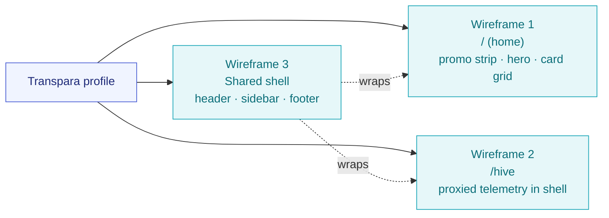

# Transpara Profile — Wireframes

**Version:** 0.3.0 · **Date:** 2026-04-20
**Author:** Claude Opus 4.7
**Owner:** Michael Saucier
**Status:** Design — recon-corrected, ready for Phase 1 implementation
**Versioning:** Versioned as part of the site-profile-redesign set (01–05). Major for structural layout changes; minor for design approach changes (new wireframes, theme variants); patch for corrections and clarifications.
**Companion:** `01-site-map-discovery.md`, `02-display-profile-system.md`, `03-transpara-profile-design.md`, `05-transpara-home-prototype.html`, `06-site-profile-redesign-recon-prompt.md`, `site-profile-redesign-recon-findings-v0.1.0.md`

---

### Revision History

| Version | Date | Description |
|---------|------|-------------|
| 0.1.0 | 2026-04-20 | Initial ASCII wireframes for home (`/`), `/hive` (proxied telemetry), and the shared shell structure. Light theme only. Comparison table vs lovyou-ai, "where next" options, acceptance check reference. |
| 0.2.0 | 2026-04-20 | Dark mode support: theme toggle glyphs (`[☀]` / `[☾]` / `[🖥]`) added to all three header wireframes and to the Legend. New §5 "Theme toggle — states and behavior" with three-state icon sketch, full dark-variant wireframe of the home page, dark-mode `/hive` Agent Status snippet, and mobile toggle placement note. Sections 5–7 renumbered to 6–8; cross-references to Artifact 3 updated to new §7 (component catalog), §8 (token sheet), §10 (acceptance test). |
| 0.2.1 | 2026-04-20 | Added standard Transpara frontmatter and revision history table. No content change. |
| 0.3.0 | 2026-04-20 | Recon corrections: **Wireframe 2 (`/hive`) rewritten** — now shows the Transpara shell wrapping an iframe boundary, not a proxied dashboard injection. Dropped the fake "Mission Control / Architecture" tab switcher (that was a design I drew over the dashboard's own internal UI, which we don't control in the iframe world). **§5.2 dark-mode `/hive` snippet rewritten** — dashboard theme-coupling limitation surfaced honestly; iframe-edge seam called out. Added §2.4 on what's inside the iframe (we don't wireframe it because we don't own it). Updated legend and cross-references to match Artifact 03 v0.3.0. |

---

> **Purpose.** Low-fidelity ASCII wireframes that fix the **layout skeleton, navigation, and content hierarchy** of the Transpara profile. These are intentionally preserved in ASCII form to avoid pixel-level work and keep the conversation at the skeleton-level where decisions actually happen.
>
> **Scope.** Three wireframes: home (`/`), `/hive` (proxied telemetry), and the shared shell structure.
>
> **Companion artifacts.** Site map (Artifact 1), profile-system architecture (Artifact 2), design specification (Artifact 3). Dimensions below are illustrative; the real grid is 12-col on a 1200px max content width. The profile ships with **both light and dark themes** plus a user-facing toggle shown in every header — the ASCII wireframes below fix the layout skeleton; palette details live in Artifact 3, §2 and §8.

---

## Legend

```
╔══╗  page boundary        ▓▓  primary CTA / active state
┌──┐  section / card       ░░  muted / placeholder
│..│  inactive surface     →   link
[X]   icon                 •   list bullet
[☀]   light theme active   [☾]  dark theme active
[🖥]  system-pref active   ⟳   processing / in-motion
```

---

## 1. Where the wireframes live in the page map



---

## 2. Wireframe 1 — `/` (Transpara home)

Mirrors `docs.transpara.com`: thin promo banner, centered hero + single CTA, 6-card grid, minimal footer.

```
╔════════════════════════════════════════════════════════════════════════════╗
║  [T] Transpara  Home  Guides  Blog  Hive   [🔎 Search ⌘K] [☀] [ My Work ▓▓]║  ← top nav (56px)
║                                                                            ║     logo+wordmark L, links center,
╠════════════════════════════════════════════════════════════════════════════╣     search + theme toggle + CTA R
║  ░░  Explore the live Hive — 12 agents running right now           →       ║  ← promo strip (36px, teal tint)
╠════════════════════════════════════════════════════════════════════════════╣
║                                                                            ║
║                                                                            ║
║                     ┌──────────────────────────────────┐                   ║
║                     │     Everything in One Place,     │                   ║
║                     │          From Any Place          │                   ║  ← hero (centered)
║                     │                                  │                   ║    H1 + subtitle + 1 button
║                     │   One view of operations across  │                   ║    no imagery in v1
║                     │   people, agents and systems.    │                   ║
║                     │                                  │                   ║
║                     │          [  Get started ▓▓ ]     │                   ║
║                     └──────────────────────────────────┘                   ║
║                                                                            ║
╠════════════════════════════════════════════════════════════════════════════╣
║                                                                            ║
║   ┌───────────────────┐  ┌───────────────────┐  ┌───────────────────┐      ║
║   │ [▦] Using the     │  │ [◇] Design        │  │ [⛓] Interfaces    │      ║
║   │     platform      │  │                   │  │                   │      ║  ← 3 × 2 card grid
║   │ ..................│  │ ..................│  │ ..................│      ║    each card: icon, title,
║   │ Explore features  │  │ Create KPIs, work │  │ Connect data and  │      ║    1–2 line description,
║   │ and views.        │  │ boards and hier-  │  │ agent endpoints.  │      ║    hover = teal border
║   │                  →│  │ archies.         →│  │                  →│      ║
║   └───────────────────┘  └───────────────────┘  └───────────────────┘      ║
║                                                                            ║
║   ┌───────────────────┐  ┌───────────────────┐  ┌───────────────────┐      ║
║   │ [⚙] Setup &       │  │ [▶] Tutorial      │  │ [?] FAQ           │      ║
║   │     Installation  │  │                   │  │                   │      ║
║   │ ..................│  │ ..................│  │ ..................│      ║
║   │ Prepare and in-   │  │ Free online       │  │ Common questions  │      ║
║   │ stall the system. │  │ courses.          │  │ and answers.      │      ║
║   │                  →│  │                  →│  │                  →│      ║
║   └───────────────────┘  └───────────────────┘  └───────────────────┘      ║
║                                                                            ║
╠════════════════════════════════════════════════════════════════════════════╣
║                   © 2026 Transpara   ·   GitHub   ·   Status               ║  ← footer (single line)
╚════════════════════════════════════════════════════════════════════════════╝
```

### Notes on the home wireframe

- Hero is deliberately quieter than lovyou-ai's manifesto: one H1, one subtitle, one button.
- The 6 cards map to: using the platform → `/app`, design → `/app/demo/board`, interfaces → `/reference`, setup → `/reference/setup`, tutorial → external training URL (or `/blog`), FAQ → `/reference/faq`. These are placeholders you can rename.
- Secondary surfaces (`/market`, `/knowledge`, `/activity`, `/agents`, `/discover`) are reachable only from search or deep links under this profile — they don't earn home real estate.

---

## 3. Wireframe 2 — `/hive` (Transpara Mission Control via iframe)

Under the Transpara profile, `/hive` is a **thin site shell wrapping an iframe** to `http://nucbuntu:8080/telemetry/`. The outer chrome — header, page-strip, footer — belongs to the site and follows the Transpara profile and theme toggle. The inner rectangle is an iframe whose content is owned and rendered by `work`. We do not wireframe the iframe's internals here because we do not own them.

```
╔════════════════════════════════════════════════════════════════════════════╗
║  [T] Transpara  Home  Guides  Blog  [Hive▓] [🔎 Search ⌘K] [☀] [ My Work ] ║  ← Transpara top nav
║                                                                            ║    "Hive" is active
╠════════════════════════════════════════════════════════════════════════════╣
║  Transpara-AI  ·  Mission Control           ● Live  8:26:20  nucbuntu:8080 ║  ← page-strip (site-owned)
║                                                                            ║    title + live dot + clock + host
╠════════════════════════════════════════════════════════════════════════════╣
║  ┌────────────────────────────────────────────────────────────────────┐    ║
║  │  IFRAME BOUNDARY                                                   │    ║
║  │  src="http://nucbuntu:8080/telemetry/"                             │    ║
║  │  ────────────────────────────────────────────────────────────────  │    ║
║  │                                                                    │    ║
║  │                                                                    │    ║
║  │                                                                    │    ║
║  │          ░░░░░░░░░░░░░░░░░░░░░░░░░░░░░░░░░░░░░░░░░░░░░░░░          │    ║
║  │          ░  Dashboard content — owned by work   ░        │    ║
║  │          ░  Renders in the dashboard's own color scheme   ░        │    ║
║  │          ░  and layout. See §2.4 for what lives inside.   ░        │    ║
║  │          ░░░░░░░░░░░░░░░░░░░░░░░░░░░░░░░░░░░░░░░░░░░░░░░░          │    ║
║  │                                                                    │    ║
║  │                                                                    │    ║
║  │                                                                    │    ║
║  │  ──────────────────────────────────────────────────────────────    │    ║
║  │  Embed mode auto-detected via /\/telemetry\/?$/ on pathname.       │    ║
║  │  Cookie auth (ws_key) set SameSite=Strict on work-server origin.   │    ║
║  │  SSE live stream to /telemetry/sse; fallback poll every 30s.       │    ║
║  └────────────────────────────────────────────────────────────────────┘    ║
║                                                                            ║
╠════════════════════════════════════════════════════════════════════════════╣
║                   © 2026 Transpara   ·   GitHub   ·   Status               ║
╚════════════════════════════════════════════════════════════════════════════╝
```

### Notes on `/hive`

- The outer chrome (nav, page-strip, footer) follows the **Transpara profile and theme toggle**. Flip to dark mode → the chrome reskins. This is what the Transpara shell controls.
- The **iframe content does NOT follow the theme toggle.** The dashboard HTML at `work:8080/telemetry/` renders in its own baked-in color scheme. See §5.2 for the honest dark-mode variant and the iframe-edge seam.
- The iframe is a **hard boundary** — no `postMessage`, no shared CSS variables, no cross-origin DOM access. The site does not inject into, reach into, or reskin the dashboard. If we wanted that, we'd do Option 3 from Artifact 02 §7 (API-only rebuild), which is roadmap-only.
- The embed-detection regex in the dashboard's JS fires naturally because the iframe's own `window.location.pathname` is `/telemetry/` on the work-server origin. This is why iframe wins over reverse-proxy at `/hive`.
- Lovyou-ai profile `/hive` is completely different — a live Phase Timeline rendered directly by the site (HTMX polling, DB + hive loop state + `git log`). No iframe under lovyou-ai.

### 2.4 What lives inside the iframe (not our wireframe)

For orientation only. The dashboard at `work:8080/telemetry/` already renders these blocks, owned by `work`:

- Expansion Phases list with Tier A/B/C/D badges
- Agent Status table (actor · state · model · iterations · trust · last-seen)
- Hive Health panel (agent count · event rate · severity · mode)
- Event Stream with SSE live updates
- Tabbed inspector: Concept Stack · Repository Strata · Role Tiers · Governance

These are defined in the dashboard's own HTML/CSS/JS (3453 lines, self-contained, zero external deps). Under the Transpara profile we **rent** this rendering — we do not duplicate, rebuild, or re-style it. The right place to improve dashboard internals is a PR to `work/dashboard/dashboard.html`.

---

## 4. Wireframe 3 — Shared shell (all Transpara pages)

```
╔════════════════════════════════════════════════════════════════════════════╗
║  HEADER  56px    logo+wordmark │ primary nav │ search │ [☾] │ CTA          ║  profile.nav.primary + theme toggle
╠════════════════════════════════════════════════════════════════════════════╣
║  (optional) promo strip 36px                                               ║  only on /, dismissible
╠══════════════════════════════════╦═════════════════════════════════════════╣
║  SIDEBAR (doc routes only)       ║  CONTENT max-width 1200px, gutters 24   ║
║   • Section A                    ║                                         ║
║     · page                       ║   <page content>                        ║
║     · page ▓                     ║                                         ║
║   • Section B                    ║   right-side on-page TOC on /reference  ║
║                                  ║   and long /blog posts (sticky)         ║
╠══════════════════════════════════╩═════════════════════════════════════════╣
║  FOOTER   © · GitHub · Status                                              ║  profile.layout.footer=minimal
╚════════════════════════════════════════════════════════════════════════════╝
```

**Sidebar visibility.** Automatically on `/reference/**` and long-form `/blog/*`. Collapses away on `/`, `/hive`, `/discover`, `/agents`, `/app/**`.

---

## 5. Theme toggle — states and behavior

The toggle is a single icon button in the header, immediately to the left of the `My Work` CTA. It cycles through three states on click: `light → dark → system → light`. The icon reflects the **active** state.

```
STATE 1 — Light active          STATE 2 — Dark active           STATE 3 — System active
                                                                (follows OS preference)

┌────────────┐                  ┌────────────┐                  ┌────────────┐
│    ☀       │ ← sun filled     │    ☾       │ ← moon filled    │    🖥       │ ← monitor
└────────────┘                  └────────────┘                  └────────────┘
 tooltip:                        tooltip:                        tooltip:
 "Light ·                        "Dark ·                         "System ·
  click for dark"                 click for system"               click for light"
```

### 5.1 Same page, two themes — home (`/`)

Layout is identical; only the palette swaps. Wireframe 1 above is the light version. Below is the same wireframe with tonal inversion to convey the dark version at the skeleton level.

```
╔════════════════════════════════════════════════════════════════════════════╗   ← bg: navy #0b1220
║ ▓▓▓▓▓▓▓▓▓▓▓▓▓▓▓▓▓▓▓▓▓▓▓▓▓▓▓▓▓▓▓▓▓▓▓▓▓▓▓▓▓▓▓▓▓▓▓▓▓▓▓▓▓▓▓▓▓▓▓▓▓▓▓▓▓▓▓▓▓▓▓▓ ║
║ ▓ [T] Transpara  Home  Guides  Blog  Hive  [🔎 Search ⌘K] [☾] [My Work ▓] ▓ ║  ← toggle now [☾]
║ ▓▓▓▓▓▓▓▓▓▓▓▓▓▓▓▓▓▓▓▓▓▓▓▓▓▓▓▓▓▓▓▓▓▓▓▓▓▓▓▓▓▓▓▓▓▓▓▓▓▓▓▓▓▓▓▓▓▓▓▓▓▓▓▓▓▓▓▓▓▓▓▓ ║
╠════════════════════════════════════════════════════════════════════════════╣
║  ▓▓  Explore the live Hive — 12 agents running right now           →       ║  ← brighter teal strip
╠════════════════════════════════════════════════════════════════════════════╣
║                                                                            ║
║                     ┌──────────────────────────────────┐                   ║
║                     │     Everything in One Place,     │                   ║   ← text: #e4e7ec
║                     │          From Any Place          │                   ║
║                     │                                  │                   ║
║                     │   One view of operations across  │                   ║   ← muted: #8891a5
║                     │   people, agents and systems.    │                   ║
║                     │                                  │                   ║
║                     │          [  Get started ▓▓ ]     │                   ║   ← teal #2bc4d6
║                     └──────────────────────────────────┘                   ║
║                                                                            ║
╠════════════════════════════════════════════════════════════════════════════╣
║   ┌───────────────────┐  ┌───────────────────┐  ┌───────────────────┐      ║
║   │░░░ card surface ░░│  │░░░ card surface ░░│  │░░░ card surface ░░│      ║   ← surface: #141c2e
║   │░[▦] Using the ░░░░│  │░[◇] Design ░░░░░░░│  │░[⛓] Interfaces ░░░│      ║     border: #232e45
║   │░░  platform  ░░░░░│  │░░░░░░░░░░░░░░░░░░░│  │░░░░░░░░░░░░░░░░░░░│      ║     primary: #2bc4d6
║   │░Explore features ░│  │░Create KPIs, work │  │░Connect data and ░│      ║
║   │░and views.░░░░░░░░│  │░boards and hier- ░│  │░agent endpoints.░░│      ║
║   │░░░░░░░░░░░░░░░░░░→│  │░░░░░░░░░░░░░░░░░░→│  │░░░░░░░░░░░░░░░░░░→│      ║
║   └───────────────────┘  └───────────────────┘  └───────────────────┘      ║
║        (3 more cards — Setup, Tutorial, FAQ — identical structure)         ║
╠════════════════════════════════════════════════════════════════════════════╣
║                   © 2026 Transpara   ·   GitHub   ·   Status               ║  ← muted footer text
╚════════════════════════════════════════════════════════════════════════════╝
```

**Notes on the dark variant:**

- No layout change — same grid, same spacing, same component tree. Only the CSS variables swap.
- Card surfaces sit one shade above the page background (`--surface: #141c2e` on `--bg: #0b1220`) to establish elevation without shadow.
- The accent teal brightens to `#2bc4d6` so links and CTAs keep WCAG AA contrast on the dark navy.
- Text is `#e4e7ec`, not pure white — pure white on deep navy is fatiguing for long sessions.
- The promo strip's tint brightens proportionally so it still reads as an accent band rather than a hole.

### 5.2 Dark variant of `/hive` — honest about the seam

`/hive` in dark mode is where the iframe boundary becomes visually obvious. The Transpara shell (nav, page-strip, footer) follows the theme toggle. The iframe content does NOT — the dashboard renders in its own fixed palette, baked into `work/dashboard/dashboard.html`.

Two realities:

**(a) Dashboard happens to have a dark-biased palette** — the seam is subtle, the experience feels cohesive:

```
╔════════════════════════════════════════════════════════════════════════════╗   ← Transpara dark
║ ▓ [T] Transpara  ...  Hive▓  [🔎] [☾] [My Work ▓]                          ▓ ║     bg #0b1220
╠════════════════════════════════════════════════════════════════════════════╣
║  Transpara-AI · Mission Control     ● Live  8:26:20  nucbuntu:8080         ║   ← page-strip dark
╠════════════════════════════════════════════════════════════════════════════╣
║  ┌────────────────────────────────────────────────────────────────────┐    ║
║  │ iframe: http://nucbuntu:8080/telemetry/                            │    ║
║  │ ╭─────────────────────────────────────────────────────────────────╮│    ║
║  │ │  (dashboard renders in its own palette —                        ││    ║
║  │ │   if dark-biased, the seam is barely visible)                   ││    ║
║  │ ╰─────────────────────────────────────────────────────────────────╯│    ║
║  └────────────────────────────────────────────────────────────────────┘    ║
╚════════════════════════════════════════════════════════════════════════════╝
```

**(b) Dashboard has a light palette while site is dark** — the seam is bright and obvious:

```
╔════════════════════════════════════════════════════════════════════════════╗   ← Transpara dark
║ ▓ [T] Transpara  ...  Hive▓  [🔎] [☾] [My Work ▓]                          ▓ ║     bg #0b1220
╠════════════════════════════════════════════════════════════════════════════╣
║  Transpara-AI · Mission Control     ● Live  8:26:20  nucbuntu:8080         ║
╠════════════════════════════════════════════════════════════════════════════╣
║  ┌────────────────────────────────────────────────────────────────────┐    ║
║  │ iframe boundary ═══════════════════════════════════════════════════│    ║   ← visible edge
║  │ ████████████████████████████████████████████████████████████████████│    ║
║  │ ██       bright dashboard content sits inside the frame         ██ │    ║
║  │ ██       — palette mismatch is intentional / unavoidable        ██ │    ║
║  │ ██       without a work-server PR for ?theme= support           ██ │    ║
║  │ ████████████████████████████████████████████████████████████████████│    ║
║  │ iframe boundary ═══════════════════════════════════════════════════│    ║
║  └────────────────────────────────────────────────────────────────────┘    ║
╚════════════════════════════════════════════════════════════════════════════╝
```

**Mitigation strategies (both deferred to post-v1):**

1. **Pass `?theme=light|dark` to the iframe URL.** Requires a PR to `work/dashboard/dashboard.html` to read the param and swap its palette. The byte-identical copy in `summary/dashboard.html` would need the same change.
2. **Match the Transpara accent to the dashboard palette.** Cosmetic only — makes the seam look intentional rather than accidental.

For v1, accept the seam. Document it. File a roadmap issue.

**What does NOT degrade in dark mode:**

- Transpara shell chrome (header, page-strip, footer) follows the toggle cleanly.
- Focus rings, selection colors, link states all use `var(--primary)` on the shell and brighten appropriately.
- The `Live` dot animation and wall clock in the page-strip remain readable on both palettes.

### 5.3 Toggle placement on mobile

On viewports below 768px, the theme toggle folds into an overflow menu along with the search icon and the primary nav. It is never hidden under a nested setting — one tap from any page is the rule.

```
┌──────────────────────────────────────┐
│ [T] Transpara            [☰]  [☾]    │  ← compact mobile header
│                                      │     toggle stays visible,
└──────────────────────────────────────┘     nav folds into ☰
```

---

## 6. What's intentionally different vs lovyou-ai

The contrast should be visible at a glance:

| Aspect | lovyou-ai | Transpara |
|--------|-----------|-----------|
| **Theme model** | Dark only, no toggle | Light default + dark + system, with toggle |
| **Background** | Near-black | White (light) / deep navy `#0b1220` (dark) |
| **Hero** | Three layered CTAs over a manifesto | Single quiet CTA |
| **Nav breadth** | 5 primary + 10 footer | 4 primary + search + toggle + CTA; footer-minimal |
| **`/hive`** | Live Phase Timeline (HTMX-polled) | Iframe to `work:8080/telemetry/` — Mission Control dashboard |
| **Typography** | Editorial serif display for headlines | Inter throughout |
| **Density** | Spacious (editorial) | Comfortable-tight (docs) |
| **Tone** | Philosophical / manifesto | Operational / product |

---

## 7. Where next — higher-fidelity options

If any of these wireframes should be promoted to higher fidelity, three options:

1. **Component inventory** — list every concrete component the Transpara profile needs (`Navbar`, `ThemeToggle`, `PromoStrip`, `HeroCentered`, `CardGrid`, `DocsSidebar`, `OnPageTOC`, `StatCard`, `PhaseList`, `AgentStatusRow`, `EventStreamItem`, `TabbedInspector`) with props and which existing lovyou-ai component each replaces or extends. *(Full catalog in Artifact 3, §7.)*
2. **Token sheet** — the final color/type/spacing tokens as CSS custom properties for **both light and dark palettes**, plus the anti-FOUC inline script, ready to paste into the codebase. *(Ready in Artifact 3, §8.)*
3. **HTML/CSS prototype** — a single static `.html` file rendering the home wireframe above with real tokens, wired to a working theme toggle, so you can eyeball both variants before any real integration.

---

## 8. Acceptance check

Use the one-glance test from Artifact 3, §10 when reviewing implementations against these wireframes. If the profile lands, every box checks on both the home and `/hive` tests — in both light and dark themes.
